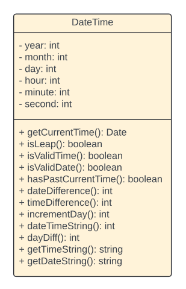
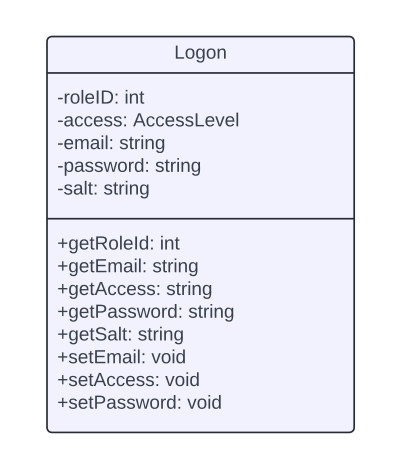

 

  

  <h3 align="center">Hotel Management System</h3>
  

   StreamLine your Hotel operations with ease!
     
    <a href="https://github.com/mrtechtroid/Programming_2_Project/blob/main/readme-assets/SRS.pdf"><strong>Explore the docs»</strong></a>
     
     
  

<!-- TABLE OF CONTENTS -->
## Table of Contents

- [About The Project](#about-the-project)
  - [Features](#features)
  - [Class Diagram](#class-diagrams)
  - [Built With](#built-with)
- [Getting Started](#getting-started)
  - [Prerequisites](#prerequisites)
  - [Installation](#installation)

- [Usage](#usage)

- [License](#license)

<!-- ABOUT THE PROJECT -->
## About The Project

[![Product Name Screen Shot][product-screenshot]](https://example.com)

The **Hotel Management System** streamlines core hotel operations such as room management, guest billing,reservations and restaurent management. 
### Features
- **Guest Management**: Add, update, and delete guest records.
- **Room Booking**: View availability, manage check-ins/outs.
- **Billing System**: Generate and manage invoices efficiently.
- **Statistics**: Generate occupancy rate and revenue on dashboard dynamically.
- **Scalable Backend**:The backend is designed with modularity in mind, enabling seamless integration with various database systems.
- **DataAccess Layer**-The system uses a well-defined data access layer (DAL) with interfaces and abstract classes. This ensures that database-specific operations (e.g., CRUD) are encapsulated, making it easy to swap or add databases like MySQL, PostgreSQL, MongoDB, or even NoSQL options with minimal changes to the codebase.

(<a href="#readme-top">back to top</a>)

### Class Diagrams

  
  
  
  
  
  
  
  

### Built With
This project utilizes the following technologies:

**Front end**
- 
- [![Next][Next.js]][Next-url]

**MiddleWare**
- 

**Backend**
- 
- 
- 
- 

(<a href="#readme-top">back to top</a>)

<!-- GETTING STARTED -->
## Getting Started

### Prerequisites

### Installation

(<a href="#readme-top">back to top</a>)

<!-- USAGE EXAMPLES -->
## Usage

Use this space to show useful examples of how a project can be used. Additional screenshots, code examples and demos work well in this space. You may also link to more resources.

_For more examples, please refer to the [Documentation](https://example.com)_

(<a href="#readme-top">back to top</a>)

<!-- LICENSE -->
## License

Distributed under the MIT License. See `LICENSE.txt` for more information.

(<a href="#readme-top">back to top</a>)

<!-- MARKDOWN LINKS & IMAGES -->
<!-- https://www.markdownguide.org/basic-syntax/#reference-style-links -->
[contributors-shield]: https://img.shields.io/github/contributors/othneildrew/Best-README-Template.svg?style=for-the-badge
[contributors-url]: https://github.com/mrtechtroid/Programming_2_Project/graphs/contributors
[forks-shield]: https://img.shields.io/github/forks/othneildrew/Best-README-Template.svg?style=for-the-badge
[forks-url]: https://github.com/mrtechtroid/Programming_2_Project/forks
[stars-shield]: https://img.shields.io/github/stars/othneildrew/Best-README-Template.svg?style=for-the-badge
[stars-url]: https://github.com/othneildrew/Best-README-Template/stargazers
[issues-shield]: https://img.shields.io/github/issues/othneildrew/Best-README-Template.svg?style=for-the-badge
[issues-url]: https://github.com/othneildrew/Best-README-Template/issues
[license-shield]: https://img.shields.io/github/license/othneildrew/Best-README-Template.svg?style=for-the-badge
[license-url]: https://github.com/othneildrew/Best-README-Template/blob/master/LICENSE.txt
[linkedin-shield]: https://img.shields.io/badge/-LinkedIn-black.svg?style=for-the-badge&logo=linkedin&colorB=555
[linkedin-url]: https://linkedin.com/in/othneildrew
[product-screenshot]: images/screenshot.png
[Next.js]: https://img.shields.io/badge/next.js-000000?style=for-the-badge&logo=nextdotjs&logoColor=white
[Next-url]: https://nextjs.org/
[React.js]: https://img.shields.io/badge/React-20232A?style=for-the-badge&logo=react&logoColor=61DAFB
[React-url]: https://reactjs.org/
[Vue.js]: https://img.shields.io/badge/Vue.js-35495E?style=for-the-badge&logo=vuedotjs&logoColor=4FC08D
[Vue-url]: https://vuejs.org/
[Angular.io]: https://img.shields.io/badge/Angular-DD0031?style=for-the-badge&logo=angular&logoColor=white
[Angular-url]: https://angular.io/
[Svelte.dev]: https://img.shields.io/badge/Svelte-4A4A55?style=for-the-badge&logo=svelte&logoColor=FF3E00
[Svelte-url]: https://svelte.dev/
[Laravel.com]: https://img.shields.io/badge/Laravel-FF2D20?style=for-the-badge&logo=laravel&logoColor=white
[Laravel-url]: https://laravel.com
[Bootstrap.com]: https://img.shields.io/badge/Bootstrap-563D7C?style=for-the-badge&logo=bootstrap&logoColor=white
[Bootstrap-url]: https://getbootstrap.com
[JQuery.com]: https://img.shields.io/badge/jQuery-0769AD?style=for-the-badge&logo=jquery&logoColor=white
[JQuery-url]: https://jquery.com 
